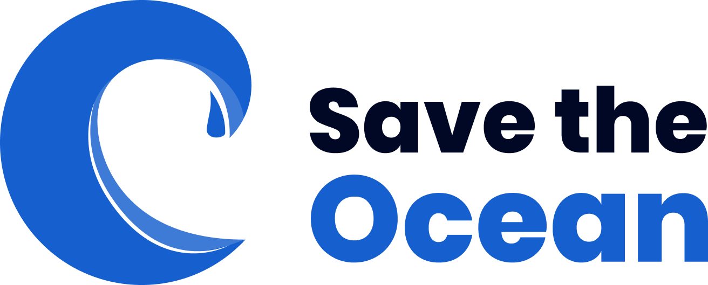
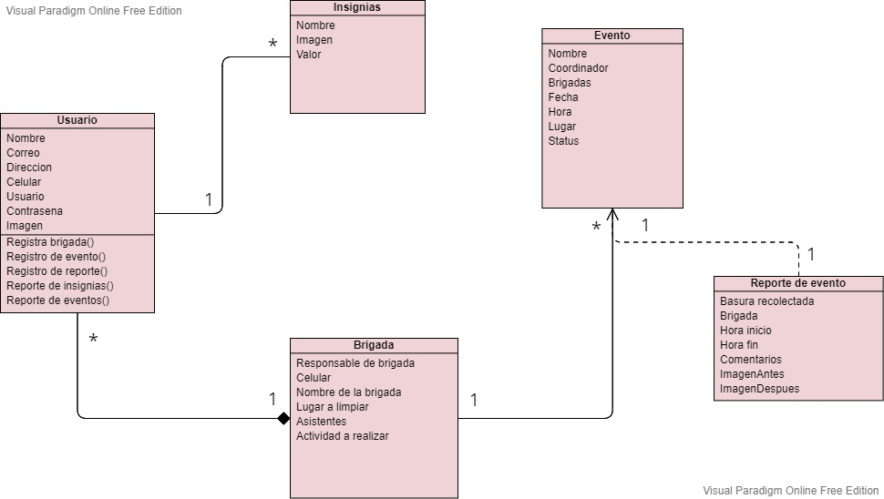
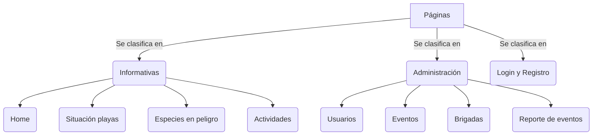

# Bootcamp Hack The Ocean
## Proyecto: **Save Ocean**


Logo creado por Equipo de Save Ocean.

### Integrantes del equipo:
1. Ricardo 
2. Fernando
3. Marco
4. Viridiana
5. Edder

#### Resolución de la problematica
> Crear un sitio informativo sobre las playas, promover el cuidado de la fauna y las brigadas que se han realizado y ver los eventos, como una galería, pero también crear y participar en ellas, donde puedan crear uno, información, y subir las pruebas de lo que se está haciendo con respecto al medio ambiente, todo esto con el fin de poder concientizar  a la población mundial sobre el gran problema que se tiene hoy en día y que los pequeños cambios que tengamos puede significar en un gran paso hacia lograr el objetivo de preservarlos. 

##### Requerimientos Funcionales
1. Registro de usuarios los cuales podrán ser responsables de brigada o participantes de una. 
2. Registro de brigadas para participar en eventos de limpieza en playas. 
3. Registro de los eventos.  
4. Resumen/Reporte de brigadas, eventos, usuarios.  
5. Se asignarán recompensas para brigadas con mejor desempeño: Badges virtuales que reconozcan logros específicos Certificado de participación. Ejemplo: “Mas botellas recolectadas”.  
6. Mostrar información sobre la situación de diversas playas en materia de limpieza. 
7. Mostrar información sobre especies directamente afectadas por la basura en playas.

A continuacion mostraremos nuestra estructura que trabajamos en la pagina web e implementandola en la página web, mediante un:

**Diagrama de Clases**


#### Estructura de la base de datos(BD)
Lo siguiente es la estructura de los campos que utilizamos para la base de datos:

| Brigada      | Eventos |
| ----------- | ----------- |
| Responsable de brigada       | Nombre del evento |
| Contacto   | Coordinador  |
|Nombre de la brigada |Fecha  |
|Lugar a limpiar |Hora |
|Asistentes |Lugar |
|Actividades a realizar ||

| Reporte Eventos      | Usuarios |
| ----------- | ----------- |
| Basura recolectada      | Nombre |
| Imágenes    | Correo   |
|Nombre de la brigada |Fecha  |
|Brigadas  |Celular  |
|Hora de inicio  |Dirección  |
|Hora de finalización  ||


Las paginas contienen la siguiente estructura que proponemos considerando los aspectos de UX/UI para que le usuario pueda usarla de manera correcta e intuitiva,por lo que se si divide de la manera siguiente:




Requiere [Express.js](https://expressjs.com) para correr.

Instala las dependencias y correr el proyecto: 
```
cd SavetheOcean
npm install
npm start
```

Link del servido montado: [SaveOcean](https://savetheocean.azurewebsites.net)

